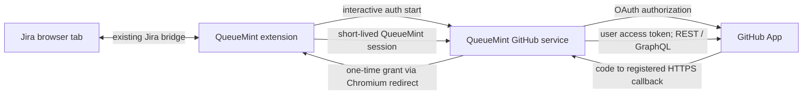

# GitHub provider for QueueMint — product and technical specification

Status: proposed design, 2026-09-24. This document describes work to build; it does not claim GitHub support exists today. The implementation sequence and acceptance criteria are in [GITHUB-PROVIDER-TASKS.md](GITHUB-PROVIDER-TASKS.md).

## 1. Customer job and scope

QueueMint should become a fast, safe companion for work managed in more than one application. A user should be able to keep the existing Jira connection, connect GitHub separately, see exactly which GitHub accounts, repositories, and Projects they can access, and act within the selected source system. GitHub remains the source of truth for GitHub data; Jira remains the source of truth for Jira data. QueueMint is not a new issue database.

**Assumption for the first useful release:** support GitHub.com, one signed-in GitHub identity per browser profile, multiple app installations under that identity, repository issue browsing and creation, and read-only organization Projects (Projects v2). Jira-to-GitHub sync and GitHub Enterprise Server are later decisions. The first release should not require a Jira connection to use GitHub, and GitHub must not break existing Jira-only users.

### Outcomes and success measures

| Outcome | Initial measure / release criterion |
| --- | --- |
| Clear access | Connection screen names the GitHub user, installation account, selected repositories, and capability gaps; a removed repository disappears after refresh. |
| Useful work | A user can find an accessible repository, read its issues, review an issue draft, create it once, and open the created issue in GitHub. |
| Project context | A user can find readable organization Projects and view their items without seeing inaccessible private repository content. |
| Jira safety | Existing Jira connection, Capture, bulk creation, worklog, saved views/actions, and portable backup continue to behave as before. |
| Reliability | Pilot measures connection success, auth failures, API rate limits, p95 read latency, and duplicate creation incidents. Set numerical SLOs after pilot traffic is measured. |

### Release boundaries

| In first release | Later, after usage evidence |
| --- | --- |
| Explicit GitHub connection/disconnection, installation and repository discovery, organization Projects v2 read view, repository issue list/detail/create, open in GitHub | Project item writes, bulk edits, automation, PR management, comments, assignments, labels, issue type parity, Capture evidence upload, personal Projects, Enterprise Server, Jira↔GitHub linking/sync |

The first issue form is deliberately small: repository, title, and Markdown body. Add labels/assignees only after permission and metadata checks are proven. GitHub issue and Project item are different objects: an issue can be represented in a Project, while a Project also contains pull requests and draft items. Do not model a GitHub Project as a Jira board or auto-place a new issue in a Project. [GitHub Projects overview](https://docs.github.com/en/issues/planning-and-tracking-with-projects/managing-items-in-your-project), [Projects API guide](https://docs.github.com/en/issues/planning-and-tracking-with-projects/automating-your-project/using-the-api-to-manage-projects).

## 2. Current QueueMint constraints

| Boundary in this repo | Current behavior | Implication |
| --- | --- | --- |
| `public/manifest.json`, `public/background.js`, `public/jira-bridge.js` | Manifest V3 extension; Jira uses an optional origin grant and the user's Jira browser session through a tab bridge. | GitHub OAuth cannot reuse the Jira cookie/tab bridge. Keep separate transports and connection state. |
| `src/features/app-orchestration/useAppState.ts`, `AppMainShell.tsx`, `AppOverlays.tsx` | Shell state and screens are Jira-shaped. | Add provider selection at the shell boundary; keep Jira feature modules intact. |
| `src/features/app-orchestration/useJiraConnection.ts`, `src/types/connection.ts` | One Jira connection and Jira tab context. | Add a provider-neutral connection registry and a GitHub connection module. Do not rename the Jira API to a generic API. |
| `src/lib/storage.ts`, `src/features/productivity/productivity-storage.ts` | Jira project/board keys and portable backup are local. | Version new provider context separately; migrate existing Jira state without resetting it; never export auth material. |
| `scripts/check-release.mjs`, `docs/PERMISSIONS.md`, `PRIVACY.md` | Exact required browser permissions and public disclosures are release gates. | Any `identity` permission or broker origin needs a deliberate audit, copy update, and test change. |
| `docs/ARCHITECTURE.md` | Production source files have a 300-line limit. | Keep provider transport, auth, discovery, screens, and orchestration in focused modules. |

These are observations from the local code on 2026-09-24, not a claim that a reusable provider framework already exists.

## 3. GitHub access model and product behavior

Choose a **GitHub App**, rather than a broad OAuth App or user supplied personal access token. GitHub Apps support selected-repository installations and scoped permissions. For user-initiated work, use a **GitHub App user access token**: GitHub intersects the user's access, the app's permissions, and where the app is installed. Installation tokens represent the app, so they must not be used to answer a user's visibility or perform that user's interactive write. [GitHub App best practices](https://docs.github.com/en/apps/creating-github-apps/about-creating-github-apps/best-practices-for-creating-a-github-app), [user authorization rules](https://docs.github.com/en/apps/creating-github-apps/authenticating-with-a-github-app/authenticating-with-a-github-app-on-behalf-of-a-user).

### Access is the intersection of several gates

```text
GitHub user authorization
  ∩ app installation on owner/account
  ∩ selected repositories in that installation
  ∩ app permission for the API action
  ∩ user's repository or Project role
  = capability actually available to QueueMint
```

Do not infer access solely from a successful OAuth callback, an installation ID in a redirect, repository visibility, or a previously cached list. GitHub organizations may require owner approval for installations; show an actionable pending/denied state. GitHub warns that setup URL `installation_id` values can be spoofed. [Installation restrictions](https://docs.github.com/en/organizations/managing-programmatic-access-to-your-organization/limiting-oauth-app-and-github-app-access-requests-and-installations), [setup URL warning](https://docs.github.com/en/apps/creating-github-apps/registering-a-github-app/about-the-setup-url).

| Operation | Planned GitHub App permission and further gate | UI when unavailable |
| --- | --- | --- |
| Identify user / list user's app installations | User authorization; use `GET /user/installations`. | Explain sign-in or installation approval. |
| List repositories in one installation | Repository Metadata read; use `GET /user/installations/{installation_id}/repositories` with user token. | Show only returned repositories; explain missing installation/repository access. |
| List/read repository issues | Repository Issues read; user also needs repository access. GitHub's issue list can include pull requests, which must be filtered or labeled explicitly. | Read-only unavailable state, never an empty list that implies no issues. |
| Create repository issue | Repository Issues write and user's effective ability; repository Issues feature enabled. | Disable create with reason; surface 403/404/410/422 accurately and preserve draft. |
| Read organization Projects v2 | Organization Projects read plus user's Project read access; verify exact GraphQL field access with a real pilot installation. | Explain separately from repository access. A public Project can contain private repository items invisible to the current user. |
| Edit Project item | Deferred; Project write and Project role must be verified per mutation. | No edit action in first release. |

GitHub documents the installation/repository discovery endpoints and the required issue permissions. Project access has its own roles (none/read/write/admin) and private item visibility. [Installation REST API](https://docs.github.com/en/rest/apps/installations), [Issues REST API](https://docs.github.com/en/rest/issues/issues), [Project access](https://docs.github.com/en/issues/planning-and-tracking-with-projects/managing-your-project/managing-access-to-your-projects), [Project visibility](https://docs.github.com/en/issues/planning-and-tracking-with-projects/managing-your-project/managing-visibility-of-your-projects).

**Permission choice before registration:** the read-only pilot requests Metadata read (required by GitHub), Issues read, and Organization Projects read. The issue-creation release upgrades Issues to write after the pilot and must handle installation-owner reapproval. Do not ask for Contents, Pull requests, Administration, Webhooks, or organization member access in either release. Validate the exact GitHub App settings and GraphQL permission behavior in the pilot; GitHub notes that GraphQL permissions need query-specific testing. [Choosing permissions](https://docs.github.com/en/apps/creating-github-apps/registering-a-github-app/choosing-permissions-for-a-github-app).

## 4. Connection and session design

The extension is a public client and cannot keep a GitHub App private key or client secret. Introduce a small QueueMint GitHub integration service for OAuth exchange, encrypted GitHub user tokens, refresh, and a narrow API for the features above. This is a new operated component; no such service exists in this repository. Direct browser-only GitHub App auth would expose credentials/tokens to the extension package or browser profile and cannot receive verified GitHub webhooks. GitHub specifically advises against shipping the app private key to client software. [GitHub App credential guidance](https://docs.github.com/en/apps/creating-github-apps/about-creating-github-apps/best-practices-for-creating-a-github-app).

| Connection option | Benefit | Cost / decision |
| --- | --- | --- |
| GitHub App with a small service (**proposed**) | Keeps GitHub secrets and refresh tokens off the extension; gives a narrow policy point, revocation, audit, and future webhook receiver. | New hosting, token store, incident response, privacy and operational ownership. |
| Browser-only GitHub App user flow with PKCE | Lower initial infrastructure cost. | A public client cannot protect a client secret or locally held GitHub tokens; loss of a browser profile has a larger GitHub blast radius, and background webhooks are unavailable. Revisit only if service ownership cannot be funded and scope is read-only. |
| User-provided personal access token | Simple prototype. | Poor onboarding and rotation, user error in permission scope, and weak product trust; not a public-release path. |

GitHub's guidance permits a public client flow with PKCE but warns that a public client cannot secure its client secret; the service choice is a QueueMint security/operations tradeoff, not a GitHub platform requirement. [GitHub App best practices](https://docs.github.com/en/apps/creating-github-apps/about-creating-github-apps/best-practices-for-creating-a-github-app), [user token flow](https://docs.github.com/en/apps/creating-github-apps/authenticating-with-a-github-app/generating-a-user-access-token-for-a-github-app).



1. User clicks **Connect GitHub**. The extension calls `chrome.identity.launchWebAuthFlow` from a user gesture. This API needs the `identity` permission and ends at `chrome.identity.getRedirectURL(...)`; the production extension ID and development ID must be registered/allowlisted separately. [Chrome identity API](https://developer.chrome.com/docs/extensions/reference/api/identity).
2. The service creates a short-lived, single-use auth transaction bound to an extension redirect URL allowlist, an unpredictable state, and PKCE. It redirects to GitHub's web authorization flow. The GitHub App callback is the service's registered HTTPS callback. The service verifies state, exchanges the code with its server-held client secret, and verifies the GitHub identity. [GitHub App user token flow](https://docs.github.com/en/apps/creating-github-apps/authenticating-with-a-github-app/generating-a-user-access-token-for-a-github-app).
3. The service stores GitHub access and refresh tokens encrypted at rest, then redirects to the Chromium callback with a one-time, short-expiry **QueueMint grant**, never a GitHub token. The extension exchanges the grant for an opaque, revocable QueueMint session credential. Validate redirect URI, transaction, and grant replay at every step.
4. For the first release, store the QueueMint session only in `chrome.storage.session`; closing the browser requires reconnect. This trades convenience for avoiding a persistent credential in extension local storage. Measure reconnect friction during pilot before considering a rotating persistent credential. Never use `chrome.storage.sync`, portable backup, URLs, logs, or analytics for credentials.
5. Use expiring GitHub user tokens and refresh them on the service under a per-user lock, persisting the replacement refresh token atomically. GitHub's expiring user tokens last eight hours and refresh tokens six months; a used refresh token is invalidated. [Refresh rules](https://docs.github.com/en/apps/creating-github-apps/authenticating-with-a-github-app/refreshing-user-access-tokens).
6. After authorization, list installations and user-visible repositories. If none exist, show **Install or request access**. After an installation/setup redirect, verify it with the user token; never trust the redirect's `installation_id` alone. Disconnect revokes the QueueMint service session, deletes stored GitHub tokens when no active connection remains, and clears GitHub UI caches/context. It must not disconnect Jira.

### Service and extension security contract

- HTTPS only. Restrict CORS to explicitly registered extension origins/IDs; reject unknown origins and arbitrary redirect targets. Rate-limit auth start, grant exchange, and mutation routes. Validate method, body size, content type, input length, and allowed repository/Project identifiers.
- The service exposes **operation-specific endpoints**, not a generic proxy to arbitrary GitHub URLs. Each request derives the GitHub user from the QueueMint session and checks current installation/resource access. Do not trust an installation ID, repository name, or Project ID merely because the extension sent it.
- All interactive reads and writes use the user token. No app private key is needed for the first release unless an explicitly approved operation requires app-level access. Keep any such future key only server-side.
- Treat auth/session tokens as secrets. Redact Authorization, OAuth code, state, private issue body, and query text from logs and traces. Separate production/dev app registrations and key material. Provide rotation and service shutdown/revocation procedures.
- Do not enable webhook processing initially. For future background sync, require signed `X-Hub-Signature-256`, delivery deduplication, quick acknowledgment, queue processing, and per-user visibility checks before showing data. [GitHub webhook signature guidance](https://docs.github.com/en/webhooks/using-webhooks/validating-webhook-deliveries).

## 5. Provider boundary and data model

Add a small shared shell contract, not a universal Jira/GitHub issue abstraction:

```ts
type ProviderId = "jira" | "github"
type ProviderConnection = {
  provider: ProviderId
  state: "disconnected" | "connecting" | "connected" | "needs-access" | "expired" | "error"
  displayAccount?: string
  checkedAt?: string
}
type WorkspaceContext =
  | { provider: "jira"; projectKey: string; boardId?: number }
  | { provider: "github"; installationId: number; repositoryId?: number; projectNodeId?: string }
```

The proposed persisted GitHub preferences are non-secret: selected installation account ID, repository ID, Project node ID, and last provider. Namespace saved views/actions by provider and resource identity when those features later support GitHub. Keep the existing `queuemint-state-v1` Jira data readable and migrate additively; do not reinterpret Jira project keys as GitHub repos. Portable backup may include non-secret GitHub preferences only after schema versioning and explicit validation; never include account tokens or private issue bodies.

GitHub resource identity uses stable GitHub IDs/node IDs plus owner/name for display and links. A repository rename updates display fields, not local identity. Issue identity is `{repositoryId, issueNumber}`; Project identity is `{ownerType, ownerId, projectNodeId, projectNumber}`. Project items carry their own node ID and content kind (`issue`, `pull-request`, `draft`). A Project can contain items from repositories outside the currently selected repository. Do not leak a private item's title into a shared cache or analytics. [Projects item model](https://docs.github.com/en/issues/planning-and-tracking-with-projects/managing-items-in-your-project), [visibility](https://docs.github.com/en/issues/planning-and-tracking-with-projects/managing-your-project/managing-visibility-of-your-projects).

### Proposed service API (versioned, subject to pilot schema proof)

| Route | Result / rule |
| --- | --- |
| `POST /v1/auth/github/start` | Starts stateful authorization for allowlisted extension callback; returns authorization URL and transaction ID. |
| `POST /v1/auth/github/exchange` | Exchanges one-time QueueMint grant; returns opaque QueueMint session and minimal GitHub user summary. |
| `POST /v1/auth/github/disconnect` | Revokes current session and GitHub authorization material owned by this connection. Idempotent. |
| `GET /v1/github/connection` | Signed-in user, auth health, installation summary, and last checked time. No tokens. |
| `GET /v1/github/installations` | User-accessible installations, paginated. |
| `GET /v1/github/installations/{id}/repositories?cursor=...` | Only repositories accessible with this user's app token, paginated. |
| `GET /v1/github/organizations/{login}/projects?cursor=...` | Accessible Projects v2 summaries; server filters hidden data and limits query depth. |
| `GET /v1/github/projects/{nodeId}/items?cursor=...` | Read-only item summaries with content kind and safe visibility handling. |
| `GET /v1/github/repositories/{id}/issues?state=...&cursor=...` | Repository issues, with PR entries excluded from an issue-only view. |
| `GET /v1/github/repositories/{id}/issues/{number}` | Issue detail and current capabilities. |
| `POST /v1/github/repositories/{id}/issues` | Validated `{title, body}` plus client request ID; returns GitHub issue identity and URL. |

Responses use a stable envelope: `{data, page?: {nextCursor}, capabilities?: {...}}`. Errors use `{error: {code, message, retryAfterSeconds?, requestId}}` with codes such as `AUTH_EXPIRED`, `INSTALLATION_REQUIRED`, `REPOSITORY_NOT_SELECTED`, `ACCESS_DENIED`, `RESOURCE_NOT_FOUND`, `PROJECT_ACCESS_REQUIRED`, `RATE_LIMITED`, `VALIDATION_FAILED`, `UPSTREAM_UNAVAILABLE`, and `WRITE_OUTCOME_UNKNOWN`. Do not return raw GitHub error payloads that may contain private resource details. Use a bounded cursor/page size, strict response projection, timeout, and cancellation. Prefer GitHub REST for repository issues and GraphQL for Projects v2; prove each exact query with the app's permissions. [Issues REST API](https://docs.github.com/en/rest/issues/issues), [Projects API guide](https://docs.github.com/en/issues/planning-and-tracking-with-projects/automating-your-project/using-the-api-to-manage-projects).

Issue creation needs special duplicate handling: a client request ID deduplicates requests observed by the service, but GitHub's create-issue endpoint has no documented idempotency key. If the service times out after forwarding a create, return `WRITE_OUTCOME_UNKNOWN`; retain the draft and ask the user to inspect the repository before retrying. Do not blindly replay uncertain writes. [Create issue behavior](https://docs.github.com/en/rest/issues/issues#create-an-issue).

## 6. UX and accessibility

1. **Connections** in Settings lists Jira and GitHub independently, with status, account, last checked time, permissions explanation, reconnect, and disconnect. Jira onboarding remains available. GitHub install/authorize and select-installation are separate steps.
2. The shell has an explicit provider switcher. Switching providers clears selected issues and pending write previews in the previous provider, while preserving unsent drafts under their own provider/resource key. A Jira screen never receives GitHub issue IDs; a GitHub screen never renders Jira-only controls (sprint, worklog, Jira custom fields).
3. GitHub home shows installation/account, repository picker, accessible Projects picker, and a clear distinction between **Repository issues** and **Projects**. A missing resource states whether authorization, installation approval, repository selection, or Project permission is needed; 403/404 may be intentionally indistinguishable when GitHub withholds details.
4. Issue creation shows repository and title/body on a review screen before the write. The success state links to the GitHub issue. Rate limit or validation errors preserve the draft; unknown outcome never auto-retries.
5. The browser-action popup remains Jira Capture in the first release, with a clear path to the GitHub workspace. GitHub evidence upload needs a separate design because Jira's attachment path cannot be reused.
6. All new controls must be keyboard operable with visible focus, labels, status announcements, logical tab order, and dialogs that return focus. English and Persian copy and right-to-left layout follow current QueueMint support. Test Chrome and Edge with screen reader and 200% zoom; do not encode access state by color alone.

## 7. Failure, performance, privacy, and operations

- **Auth:** expired/revoked user token triggers one locked refresh; reauthorization if refresh fails. A revoked installation or removed repository invalidates cached capabilities promptly on 403/404 and on manual refresh. Never show cached private data after disconnect.
- **Upstream limits:** obey `Retry-After` and `x-ratelimit-reset`; bound concurrency and use short-lived cache/conditional reads where appropriate. Do not background-poll all repositories. REST and GraphQL have separate limits, and GitHub also enforces secondary limits. [REST limits](https://docs.github.com/en/rest/using-the-rest-api/rate-limits-for-the-rest-api), [GraphQL limits](https://docs.github.com/en/graphql/overview/rate-limits-and-query-limits-for-the-graphql-api).
- **Availability:** Jira is independent of the GitHub service. If the service is down, GitHub shows a retryable unavailable state and preserves local drafts. On-screen reads may use a short per-user cache; every mutation and access-sensitive read rechecks authorization. No offline write queue.
- **Privacy:** store only GitHub token material and minimal session/account metadata on the service, encrypted with rotation and access audit. Do not store a server-side issue mirror in the first release. Keep issue bodies out of telemetry; redact repository/Project names if telemetry leaves the service. Define token deletion and backup retention before launch, and update `PRIVACY.md` and `SECURITY.md`.
- **Observability:** correlate extension/service/GitHub calls with a generated request ID, not the auth code or issue body. Record auth completion/failure, installation count, permission-denied category, rate-limit class, API latency, create success/unknown outcome, token refresh failure, and service availability. Alert on auth failure surge, 5xx, refresh failures, and unusual create volume.
- **Abuse and cost:** per-session/IP auth and write limits, payload caps, GitHub query cost budget, no arbitrary GraphQL from clients, encrypted token store, and a kill switch for GitHub writes. The service adds hosting, secret management, support, and incident ownership; assign these before rollout.

## 8. Rollout and verification

1. Register separate development and production GitHub Apps and a service environment; prove OAuth callback and extension IDs in Chrome and Edge. Confirm organization installation policy with one pilot org and a selected repository installation.
2. Ship provider shell behind a local/remote feature flag, default off. First release to internal users: connect, installations, repos, and read-only Projects/issues. Record denied/private/revoked cases.
3. Enable issue creation for the pilot only after user-token attribution, permission, draft preservation, unknown-write handling, and write kill switch pass. Expand gradually by extension release cohort.
4. Roll back by disabling GitHub entry points and service writes; preserve Jira path and local GitHub drafts. Revoke service credentials if a security incident occurs. Provide a manual token/key rotation and user notification runbook.

Minimum verification matrix: Jira-only upgrade; GitHub-only onboarding; multiple installations; selected-repo restriction; org owner approval pending; private repo access removal; Project readable but item private; user can read but cannot create; OAuth cancellation/replay; browser restart; token refresh race; 403/404/410/422; 429 and retry headers; service timeout after write; repository rename; Persian/English and screen reader; Chrome/Edge; backup exclusion; disconnect cache purge; release permission guard.

## 9. Decisions and validation gates

| Decision | Current proposal | What must be proven before build/launch |
| --- | --- | --- |
| GitHub product scope | Repository issues + organization Projects read view; no sync. | Confirm priority of issue creation versus project browsing with target users. |
| GitHub auth | GitHub App user token held by a small service. | End-to-end browser callback, app approval, and token refresh spike. |
| Projects | Organization Projects v2 read-only. | Pilot GraphQL query against private/public projects and hidden private repo items; confirm exact app permission. |
| Personal Projects | Defer from first release. | Separate access/permission spike, then explicit acceptance criteria. |
| Session persistence | `chrome.storage.session`; reauth after browser restart. | Measure friction in pilot; decide whether a rotating persistent QueueMint credential is justified. |
| Service ownership | New operated QueueMint service. | Named owner, hosting region, incident response, secret storage, and data retention before production. |

## 10. Source references checked 2026-09-24

- [GitHub App authentication and token types](https://docs.github.com/en/apps/creating-github-apps/authenticating-with-a-github-app/about-authentication-with-a-github-app)
- [GitHub App user authorization and permission intersection](https://docs.github.com/en/apps/creating-github-apps/authenticating-with-a-github-app/authenticating-with-a-github-app-on-behalf-of-a-user)
- [GitHub App permissions](https://docs.github.com/en/apps/creating-github-apps/registering-a-github-app/choosing-permissions-for-a-github-app)
- [GitHub App installation discovery](https://docs.github.com/en/rest/apps/installations)
- [GitHub REST issues](https://docs.github.com/en/rest/issues/issues)
- [GitHub Projects API](https://docs.github.com/en/issues/planning-and-tracking-with-projects/automating-your-project/using-the-api-to-manage-projects)
- [GitHub Project visibility and access](https://docs.github.com/en/issues/planning-and-tracking-with-projects/managing-your-project/managing-visibility-of-your-projects)
- [Chrome Manifest V3 identity API](https://developer.chrome.com/docs/extensions/reference/api/identity)
